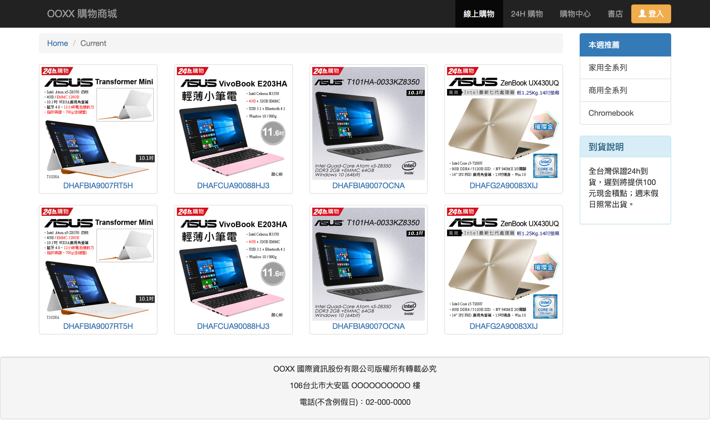

# 練習題

**lg**

**md**

* 練習一 (15 min)
  1. 佈局練習：NavBar, 漢堡包 (hamburger)
  1. 佈局練習：Footer, text-center, panel
* 練習二 (10 min)
  1. navbar-btn
  1. icon
* 練習三 (10 min)
  1. 基本 Grid 練習
  1. Components 練習：左側選單 list-group
* 練習四（15 min)
  1. Components 練習：breadcrumb
  1. navbar-inverse
  1. 巢狀 Grid
  1. 查看所有版本結果
* 練習五 (10 min)
  1. push, pull
  1. 下拉式選單
  1. hamburger 解說: data-toggle, data-target
* 回家作業：個人的線上履歷設計

