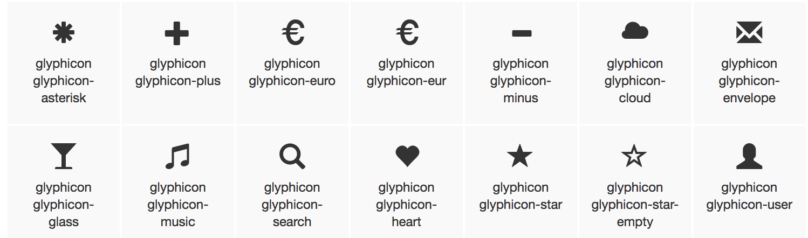

# 圖示字型 (Glyphicons)



* Don't mix with other components
* Only for use on empty elements

**語法**

```html
<span class="glyphicon glyphicon-name"></span>
```

**範例**

```html
<button type="button" class="btn btn-info">
  <span class="glyphicon glyphicon-search"></span> Search
</button>
```

### Font Awesome

<http://fontawesome.io/>

```html
<i class="fa fa-camera-retro fa-lg"></i>
<i class="fa fa-camera-retro fa-2x"></i>
<i class="fa fa-camera-retro fa-3x"></i>
<i class="fa fa-camera-retro fa-4x"></i>
<i class="fa fa-camera-retro fa-5x"></i>
```

**延伸閱讀**

* [BootCSS - Font Awesome](http://www.bootcss.com/p/font-awesome/)
* [Bootstrap - Glyphicons](http://getbootstrap.com/components/#glyphicons)
* [w3schools 的 Bootstrap Glyphicons 範例](http://www.w3schools.com/bootstrap/tryit.asp?filename=trybs_glyphs&stacked=h)
