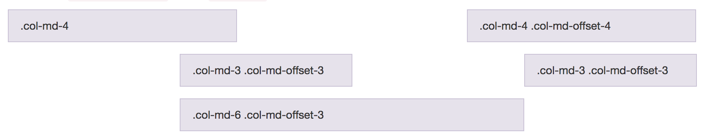
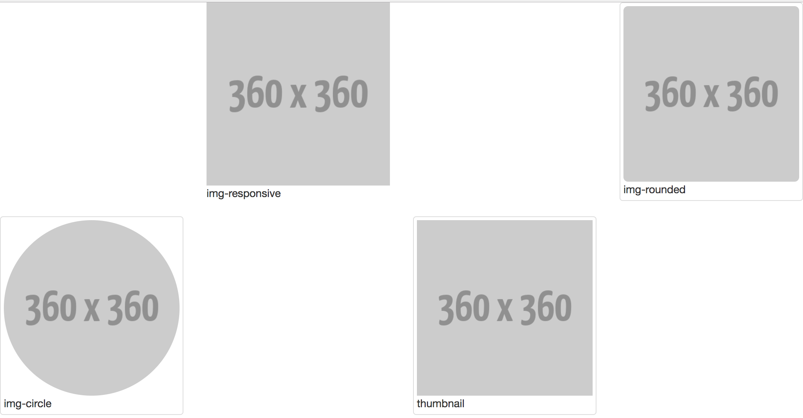
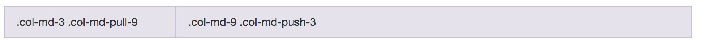
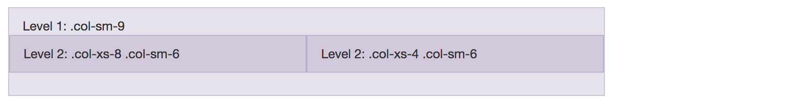
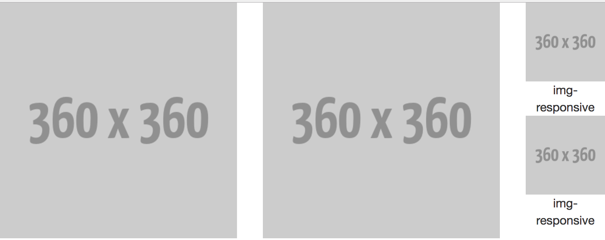

# 網格 (Grid)


* 以行動為優先的流動格線系統，並且隨著設備或可視區域大小縮放，格現系統會自動擴大最大至 12 個欄位。
* 注意：外層要先定義一個 row 類別

<!--
* 為什麼我們需要網格？
  * 1000 / 4 = ?
  * 1024 / 4 = ?
  * 1980 / 12 = ?
* 我們天生就不擅長於精確的計算，但我們擅長比較。
-->

### 網格類別命名規則

| 標記名稱        | 銀幕尺寸           | 裝置  |
| :------------- | :--------------- | :---- |
| xs             | 768 px 以下       | 手機  |
| sm             | 768 px ~ 992 px  | 平板  |
| md             | 992 px ~ 1200 px | 桌機  |
| lg             | 1200 px 以上      | 投影機 / 電視 |

### 基本類別 (class)

* row
* col-lg-2
* col-md-4
* col-sm-6
* col-xs-12

```html
<div class="row">
  <div class="col-xs-6">區塊一</div>
  <div class="col-xs-6">區塊二</div>
  <div class="col-xs-6">區塊三</div>
  <div class="col-xs-6">區塊四</div>
  <div class="col-xs-6">區塊五</div>
  <div class="col-xs-6">區塊六</div>
</div>
```

**練習題**

在 lg 尺寸時，變成一列四欄，在 md 尺寸時，變成一列三欄，在 sm 尺寸時，變成一列二欄，在 xs 尺寸時，變成一列一欄。


### 位移 (Offsetting columns)



* col-md-offset-*

```html
<div class="row">
  <div class="col-md-4">.col-md-4</div>
  <div class="col-md-4 col-md-offset-4">.col-md-4 .col-md-offset-4</div>
</div>
<div class="row">
  <div class="col-md-3 col-md-offset-3">.col-md-3 .col-md-offset-3</div>
  <div class="col-md-3 col-md-offset-3">.col-md-3 .col-md-offset-3</div>
</div>
<div class="row">
  <div class="col-md-6 col-md-offset-3">.col-md-6 .col-md-offset-3</div>
</div>
```

**練習題**



### 欄位排序 (Column ordering)

使用情境：在不同 size 的裝置時，想顯示不同排序順序。



* 推：col-md-push-*
* 拉：col-md-pull-*

```html
<div class="row">
  <div class="col-md-9 col-md-push-3">.col-md-9 .col-md-push-3</div>
  <div class="col-md-3 col-md-pull-9">.col-md-3 .col-md-pull-9</div>
</div>
```

### 巢狀 (Nesting columns)

使用情境：更細部的切版



```html
<div class="row">
  <div class="col-sm-9">
    Level 1: .col-sm-9
    <div class="row">
      <div class="col-xs-8 col-sm-6">
        Level 2: .col-xs-8 .col-sm-6
      </div>
      <div class="col-xs-4 col-sm-6">
        Level 2: .col-xs-4 .col-sm-6
      </div>
    </div>
  </div>
</div>
```

**練習題**



### 延伸閱讀

* [Bootstrap - CSS Grid](http://getbootstrap.com/css/#grid)
* [Bootstrap - Grid Example](http://getbootstrap.com/examples/grid/)
* [w3schools - Bootstrap Grid System](http://www.w3schools.com/bootstrap/bootstrap_grid_system.asp)
