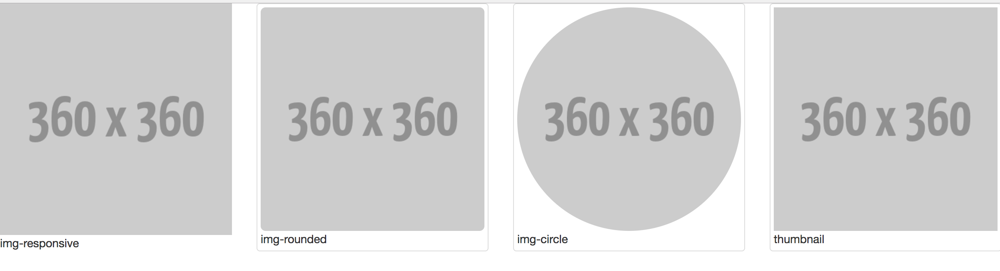

# 圖片(Image)



**類別**

* img-rounded (圓角)
* img-circle (圓形)
* img-thumbnail (加外框)
* img-responsive：圖片會佔其容器的全部寬度，而高度會按比例調整。
* thumbnail (圖文)

**圓角**

```html

```

**圓形**

```html

```

**加外框**

```html

```

**圖文**

```html
<div class="thumbnail">
  <a href="">
    
    <div class="caption">
      <p>Lorem ipsum...</p>
    </div>
  </a>
</div>
```

**練習題**


**延伸閱讀**

* [Bootstrap Images](http://www.w3schools.com/bootstrap/bootstrap_images.asp)
