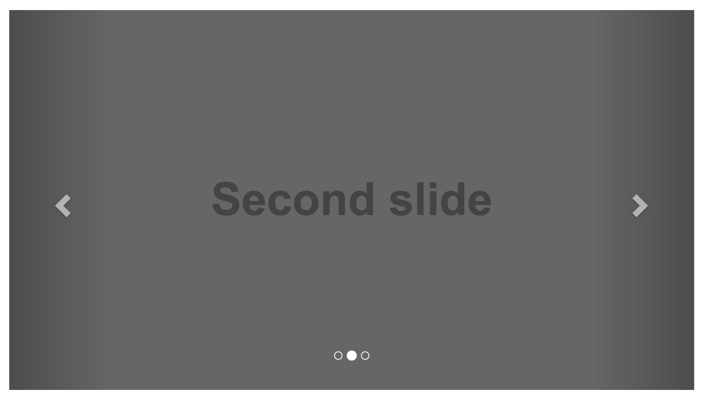

# 輪播效果 (carousel)


### 基本結構

* Indicators
* Wrapper for slides
* Controls



```html
<div id="carousel-example-generic" class="carousel slide" data-ride="carousel">
  <!-- Indicators -->
  <ol class="carousel-indicators">
    <li data-target="#carousel-example-generic" data-slide-to="0" class="active"></li>
    <li data-target="#carousel-example-generic" data-slide-to="1"></li>
    <li data-target="#carousel-example-generic" data-slide-to="2"></li>
  </ol>

  <!-- Wrapper for slides -->
  <div class="carousel-inner" role="listbox">
    <div class="item active">
      
      <div class="carousel-caption">
        ...
      </div>
    </div>
    <div class="item">
      
      <div class="carousel-caption">
        ...
      </div>
    </div>
    ...
  </div>

  <!-- Controls-->
  <a class="left carousel-control" href="#carousel-example-generic" role="button" data-slide="prev">
    <span class="glyphicon glyphicon-chevron-left" aria-hidden="true"></span>
    <span class="sr-only">Previous</span>
  </a>
  <a class="right carousel-control" href="#carousel-example-generic" role="button" data-slide="next">
    <span class="glyphicon glyphicon-chevron-right" aria-hidden="true"></span>
    <span class="sr-only">Next</span>
  </a>
</div>
```

[官方文件傳送門](http://getbootstrap.com/javascript/#carousel)

### 延伸閱讀

* [w3cschool bootstap - carousel](http://www.w3schools.com/bootstrap/bootstrap_ref_js_carousel.asp)
