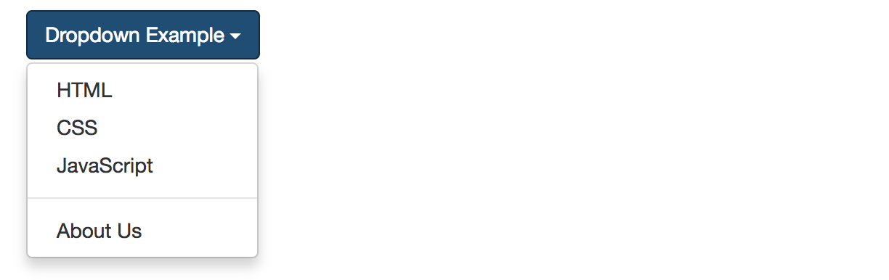
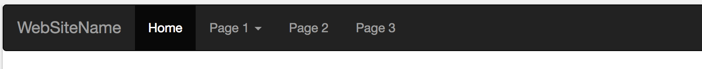

# 下拉式選單 Dropdown

### 基本結構

```
<div class="dropdown">
  <a id="dLabel" data-target="#" href="#" data-toggle="dropdown" role="button" aria-haspopup="true" aria-expanded="false">
    Dropdown trigger
    <span class="caret"></span>
  </a>

  <ul class="dropdown-menu" aria-labelledby="dLabel">
    ...
  </ul>
</div>
```

**導覽列 (Navigation Bar) 與下拉式選單 (Dropdown)**

```html
<li class="dropdown">
  <a href="#" class="dropdown-toggle" data-toggle="dropdown" role="button" aria-haspopup="true" aria-expanded="false">母分類<span class="caret"></span></a>
  <ul class="dropdown-menu">
    <li><a href="#">子分類 1</a></li>
    <li><a href="#">子分類 2</a></li>
  </ul>
</li>
```

### 觸發方式

**透過 data 屬性 trigger**

```html
<a href="#" class="dropdown-toggle" data-toggle="dropdown">Dropdown Example</a>
```

**透過 JS trigger**

```js
$('.dropdown-toggle').dropdown();
```

### 文件

**Plugin Classes**

* dropdown (必要)
* dropdown-menu (必要，dropdown-menu-right 二選一)
* dropdown-menu-right
* dropdown-header
* dropup (往上)
* disabled
* divider (分隔線)

[demo](http://www.w3schools.com/bootstrap/tryit.asp?filename=trybs_ref_js_dropdown&stacked=h)

**Methods**

* dropdown("toggle")

**Events**

* show.bs.dropdown
* shown.bs.dropdown
* hide.bs.dropdown
* hidden.bs.dropdown

[官方文件傳送門](http://getbootstrap.com/javascript/#dropdowns)

### 範例

**Button 元素的 Dropdown**



```html
<div class="dropdown">
    <button class="btn btn-primary dropdown-toggle" id="menu1" type="button" data-toggle="dropdown">Dropdown Example
    <span class="caret"></span></button>
    <ul class="dropdown-menu" role="menu" aria-labelledby="menu1">
      <li role="presentation"><a role="menuitem" tabindex="-1" href="#">HTML</a></li>
      <li role="presentation"><a role="menuitem" tabindex="-1" href="#">CSS</a></li>
      <li role="presentation"><a role="menuitem" tabindex="-1" href="#">JavaScript</a></li>
      <li role="presentation" class="divider"></li>
      <li role="presentation"><a role="menuitem" tabindex="-1" href="#">About Us</a></li>    
    </ul>
  </div>
```

[w3cschool bootstrap - button dropdown demo](http://www.w3schools.com/bootstrap/tryit.asp?filename=trybs_ref_js_dropdown&stacked=h)

**Navbar 和 Dropdown**



[w3cschool bootstrap - navbar dropdown demo](http://www.w3schools.com/bootstrap/tryit.asp?filename=trybs_navbar_dropdown&stacked=h)

```html
<nav class="navbar navbar-inverse">
  <div class="container-fluid">
    <div class="navbar-header">
      <a class="navbar-brand" href="#">WebSiteName</a>
    </div>
    <div>
      <ul class="nav navbar-nav">
        <li class="active"><a href="#">Home</a></li>
        <li class="dropdown">
          <a class="dropdown-toggle" data-toggle="dropdown" href="#">Page 1
          <span class="caret"></span></a>
          <ul class="dropdown-menu">
            <li><a href="#">Page 1-1</a></li>
            <li><a href="#">Page 1-2</a></li>
            <li><a href="#">Page 1-3</a></li>
          </ul>
        </li>
        <li><a href="#">Page 2</a></li>
        <li><a href="#">Page 3</a></li>
      </ul>
    </div>
  </div>
</nav>
```

### 延伸閱讀

* [w3cschool bootstrap - Multi-Level Dropdowns](http://www.w3schools.com/bootstrap/tryit.asp?filename=trybs_ref_js_dropdown_multilevel&stacked=h)
