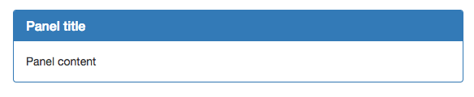
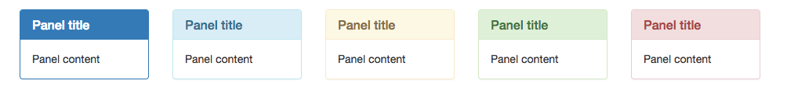

# OOCSS

**OOCSS兩大原則**

* 結構與外觀分離(Separate structure and skin)
* 容器與內容分離(Separate container and content)

#### Object

* panel

#### 結構(Structural properties)



* panel-heading
* panel-body
* panel-footer

```html
<div class="panel panel-primary">
    <div class="panel-heading">
      <h3 class="panel-title">Panel title</h3>
    </div>
    <div class="panel-body">
      Panel content
    </div>
</div>
```

```
Display
Position
Margin
Padding
Height
Width
Overflow
```

#### 外觀(skin properties)



* panel-primary
* panel-info
* panel-warning
* panel-success
* panel-danger

```
Font
Color
Gradient
Shadow
```

#### 容器與內容分離

```html
<a href="#" class="btn btn-info" role="button">Button</a>
<button type="button" class="btn btn-info">Button</button>
<input type="button" class="btn btn-info" value="Button">
<input type="submit" class="btn btn-info" value="Button">
```

**Old Style**

```css
#sidebar {
    padding: 2px;
    margin: 2px;
    position: absolute;
    left: 0;
    width: 120px;
}
#sidebar .list {
    margin: 2px;
}
#sidebar .list .list-header {
    font-size: 16px;
    color: red;
}
#sidebar .list .list-body {
    font-size: 12px;
    color: #cdcdcd;
    background-color: red;
}
```

**Better**

```css
.sidebar {
    padding: 2px;
    margin: 2px;
    position: absolute;
    left: 0;
    width: 120px;
}
 
.list {
    margin: 2px;
}
 
.list-header {
    font-size: 16px;
    color: red
}
 
.list-body {
    font-size: 12px;
    color: #cdcdcd;
    background-color: red;
}
```


資料來源：[漫談 CSS 架構方法 - 以 OOCSS, SMACSS, BEM 為例](http://www.slideshare.net/kurotanshi/css-oocss-smacss-bem)