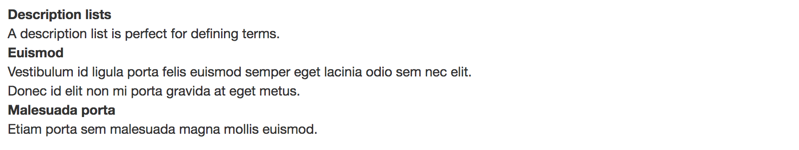
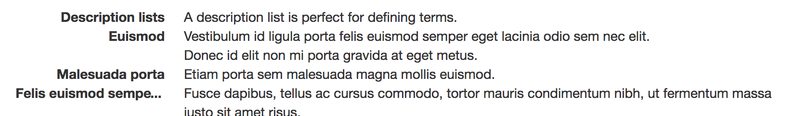
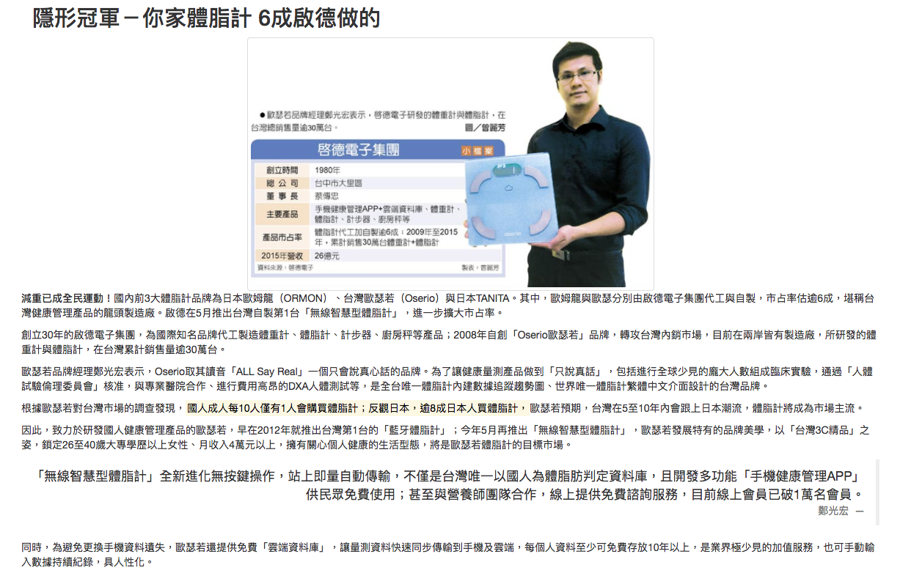

# 排版 (Typography)

**名詞定義**

* 元素 element 或 標籤 tag
* 屬性 attribute 或 特性 properties
* 參數 attribute-value
* 事件 event

**語法**

```html
<element attribute="attribute-value">
```

**範例**

class 和 id 都是我們的屬性，onclick 是我們的事件。

```html
<div class="nickname" id="nicknameId" onclick="">alincode</div>
```

**提醒**

* 使用正確的語意元素

### 標題 (Headings)

* h1 ~ h6

### 段落

* lead

```html
<p>...</p>
<p class="lead">...</p>
```

### Inline 文字元素

* mark：高亮顯示
* del：刪除的文字
* s：刪除線
* ins：插入的文字
* u：下底線
* small: element is used to create a lighter, secondary text in any heading
* strong：粗體
* em：斜體

### 對齊類別 (Alignment classes)

```html
<p class="text-left">靠左</p>
<p class="text-center">置中</p>
<p class="text-right">靠右</p>
<p class="text-justify">Justified text.</p>
<p class="text-nowrap">No wrap text.</p>
```

### 轉換類別 (Transformation classes)

```html
<p class="text-lowercase">Lowercased text.</p>
<p class="text-uppercase">Uppercased text.</p>
<p class="text-capitalize">Capitalized text.</p>
```

顯示結果

```
lowercased text.
UPPERCASED TEXT.
Capitalized Text.
```

### 縮寫 (Abbreviations)

```html
<abbr title="attribute">attr</abbr>
<abbr title="HyperText Markup Language" class="initialism">HTML</abbr>
```

### 地址 (Addresses)

```html
<address>
  <strong>Twitter, Inc.</strong><br>
  1355 Market Street, Suite 900<br>
  San Francisco, CA 94103<br>
  <abbr title="Phone">P:</abbr> (123) 456-7890
</address>

<address>
  <strong>Full Name</strong><br>
  <a href="mailto:#">first.last@example.com</a>
</address>
```

### 引用 (Blockquotes)

靠左

```html
<blockquote>
  <p>Lorem ipsum dolor sit amet, consectetur adipiscing elit. Integer posuere erat a ante.</p>
  <footer>Someone famous in <cite title="Source Title">Source Title</cite></footer>
</blockquote>
```

靠右

```html
<blockquote class="blockquote-reverse">
  <p>Lorem ipsum dolor sit amet, consectetur adipiscing elit. Integer posuere erat a ante.</p>
  <footer>Someone famous in <cite title="Source Title">Source Title</cite></footer>
</blockquote>
```

### 清單 (List)

**無序清單**

* ul > li
* ul.list-unstyled > li

```html
<ul class="list-unstyled">
  <li>...</li>
</ul>
```

**有序清單**

* ol > li

**Inline 清單**

```html
<ul class="list-inline">
  <li>...</li>
</ul>
```

**描述清單**



```html
<dl>
  <dt>...</dt>
  <dd>...</dd>
</dl>
```



```html
<dl class="dl-horizontal">
  <dt>...</dt>
  <dd>...</dd>
</dl>
```

### 補充一

* 有時候你需要 Bootstrap h2 的 css 樣式，但卻不想使用 h2 元素的時候，你可以把 h2 當 css 名稱使用。
* 例如...


```html
<h2></h2>
```

等同於

```html
<div class="h2"></div>
```

### 補充二

* *-horizontal (水平)
* *-inverse (反轉)

```
blockquote
blockquote-reverse

navbar
navbar-inverse
```

<https://getbootstrap.com/examples/navbar/>

### 練習題

排版練習：找一段文章，使用適合的元素或類別，重新組合排版。

善用 article, header, h2, section, time, p, figure, figcaption, em, u, mark 標籤。



[隱形冠軍－你家體脂計 6成啟德做的 - 中時電子報](http://www.chinatimes.com/newspapers/20160511000151-260204)

### 延伸閱讀

* [Bootstrap - Typography](http://getbootstrap.com/css/#type)
* [w3school - Bootstrap Typography](http://www.w3schools.com/bootstrap/bootstrap_typography.asp)
