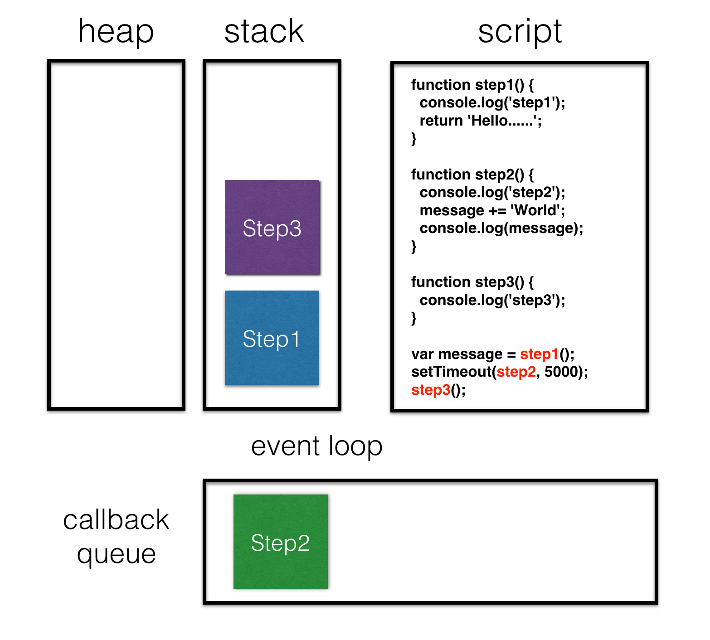

# 非同步 (async)

* JavaScript 語言的一大特點就是單執行緒，同一個時間只能做一件事。
* 所有事件可以分為 synchronous 和 asynchronous。
* 同步事件指的是，在主線程上排隊執行的任務，只有前一個任務執行完畢，才能執行後一個任務。
* 非同步事件指的是，先進入 task queue (event loop)，task queue 通知主線程(stack)，若主線程有空該任務才會進入主線程執行。



* event loop

```js
function step1() {
  console.log('step1');
  return 'Hello......';
}

function step2() {
  console.log('step2');
  message += 'World';
  console.log(message);
}

function step3() {
  console.log('step3');
}

var message = step1();
setTimeout(step2, 5000);
step3();
```

### 延伸閱讀

<!-- 從 6:40 開始看 -->

* [Philip Roberts: Help, I’m stuck in an event-loop. on Vimeo](https://vimeo.com/96425312)
* [並發模型和事件循環 - JavaScript | MDN](https://developer.mozilla.org/zh-TW/docs/Web/JavaScript/EventLoop)