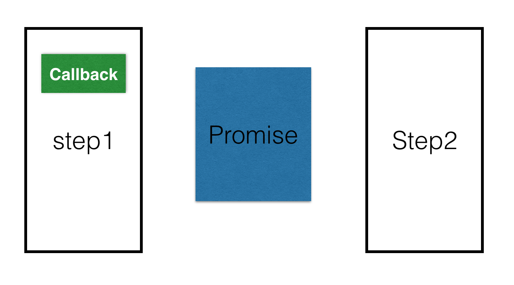

# Promise

<!-- 
* callback 有兩個缺點，哪兩個缺點？
1. 無法信任
2. 流程混亂

* Promise 的出現是為了修補哪一個缺點？
-->


**狀態**

* pending：等待中，為初始之狀態，即不是 fulfilled 也不是 rejected。
* fulfilled：已實現，表示操作成功完成。
* rejected：已拒絕，表示操作失敗。


有可能會發生在履行(fulfill) 或拒絕的 Promise，取決於傳入了什麼給它。

```js
const promise = new Promise(function(resolve, reject) {
  setTimeout(function() {
		resolve('success');
		//reject('error');
	},2000);
});

promise.then(function(value) {
  console.log('on fulfillment');
}, function(reason) {
  console.log('on rejection');
});
```

**Promise 是什麼？**

* 它是一種控制流程機制，提供比 callback 更好的一種表達非同步程式邏輯。
* Promise 的出現，並沒有去除 callback，只是把這些 callback 的協調工作，轉交給了介於我們與其他工作之間的一種「可信任的中介機制」。
* 它是可以輕易重複用來封裝與合成「未來值」的一種機制。



### 未來值

等值的承若 (vlue-promise)，例如取餐收據。

```js
add(fetchX, fetchY, function(sum){
  console.log(sum);
});
```
<!--如何確保 x, y 同時到達，再進行加法運算？-->

### 方法

* Promise.reject(reason)
* Promise.resolve(value)
* Promise.all(iterable)
* Promise.race(iterable)

**Promise.resolve(value)**

```js
Promise.resolve("Success").then(
  function(value) {
    console.log(value); // Success
  }, 
  function(err) {
    // 不會被呼叫
});
```

```js
Promise.resolve(new Error("fail")).then(
  function(value) {
    console.log(value); // on fulfilled
  }, 
  function(err) {
    // 不會被呼叫
});
```

**Promise.reject(reason)**

代表發生拒絕的情況

```js
Promise.reject('hi').then(
  function(error) {
    // 不會被呼叫
  }, 
  function(error) {
    console.log(error); // Stacktrace
});
```

```js
Promise.reject(new Error("fail")).then(
  function(error) {
    // 不會被呼叫
  }, 
  function(error) {
    console.log(error); // Stacktrace
});
```

**Promise.all(iterable)**

所傳入的所有 prmises 都必須履行 (fulfill)，所回傳的 promise 才會履行。

```js
var p1 = Promise.resolve(1);
var p2 = Promise.resolve('Hello World');
var p3 = Promise.resolve('Oops');

Promise.all([p1, p2, p3]).then(function(msg){
  console.log(msg);
});

Promise.all([p1, p2, p3]).catch(function(err){
  console.log(err);
});
```

**Promise.race(iterable)**

只要第一個解析的 promise 會勝出，而無論哪個解析結果為何，都會成為所回傳的 promise 的解析結果。

```js
var p1 = Promise.resolve(1);
var p2 = Promise.resolve('Hello World');
var p3 = Promise.resolve('Oops');

Promise.race([p1, p2, p3]).then(function(msg){
  console.log(msg);
});
```
<!--執行結果為 p1，但未必每次都是 p1，因為是非同步競賽。-->

### Promise 原型方法

**Promise.prototype.then(onFulfilled, onRejected)**

```js
var p1 = new Promise(
  function(resolve, reject) {
    setTimeout(function(){
        resolve("Success!");
    }, 5000);
    // 或 reject ("Error!");
  }
);
```

* fulfillment 履行
* rejection 拒絕

```js
p1.then(
  // fullfilment handler
  function(value) {
    console.log(value); 
  },
  // rejection handler
  function(reason) {
    console.log(reason);
  }
);
```

```js
p.then(fulfilled);
p.then(fulfilled, rejected);
```

**Promise.prototype.catch(onRejected)**

```js
p.catch(rejected);
p.then(null, rejected);
```

## 錯誤處理

<!-- try...catch 無法處理跨非同步作業運作 -->

```js
function func(){
  setTimeout(function(){
    // 故意打錯的
    consoe.log('hi');
  }, 5000);
}

try {
  func();
} catch(err){
  console.log('I am error.', err); // 會發生什麼事？
}
```

**Promise 相容性**

* [Promise 相容性測試](http://caniuse.com/#feat=promises)
* [ES6 Promise Polyfill](https://github.com/stefanpenner/es6-promise)

### Promise 需注意的事項

* 不要忘最後面要接 `catch`

### 只能回傳一個參數

```js
var p1 = new Promise(
  function(resolve, reject) {
    resolve("Success!");
  }
);
```

```js
var p1 = new Promise(
  function(resolve, reject) {
    let obj = {
      id: 1,
      message: 'success'
    }
    resolve(obj);
  }
);
```

### Weird

假如傳入給 resolve 的是一個立即的**非 Promise、非 thenable 的值**，那麼 promise 就會以那個值被履行。

```js
var p3 = new Promise(function(resolve, reject){
  resolve('B');
});

var p1 = new Promise(function(resolve, reject){
  resolve(p3);
});

var p2 = new Promise(function(resolve, reject){
  resolve('A'); // immediate value
});

p1.then(function(v){
  console.log(v);
});

p2.then(function(v){
  console.log(v);
});
```
<!-- A B -->

### 完整例子

<http://jsfiddle.net/ddam2mof/3/>

```js
getArticleList().then(function(articles){
	return getArticle(articles[0].id);
}).then(function(article){
    return getAuthor(article);
}).then(function(author){
	alert(author.email);
});

function getAuthor(id){
  return new Promise(function(resolve, reject){
    $.ajax("http://beta.json-generator.com/api/json/get/E105pDLh",{
        author: id
    }).done(function(result){
        resolve(result);
    })
  });
}

function getArticle(id){
  return new Promise(function(resolve, reject){
    $.ajax("http://beta.json-generator.com/api/json/get/EkI02vUn",{
        id: id
    }).done(function(result){
        resolve(result);
    })
  });
}

function getArticleList(){
  return new Promise(function(resolve, reject){
    $.ajax(
    "http://beta.json-generator.com/api/json/get/Ey8JqwIh")
    .done(function(result){
        resolve(result);
    });
  });
}
```

### JQuery

<https://jsfiddle.net/daronwolff/n10n17ag/>

```js
(function() {
  var restante = 0;
  'use strict';

  function wait() {
    return new Promise(function(done, reject) {
      setTimeout(function() {
        if (restante > 0) {
          done();
        } else {
          reject();
        }
      }, 2000);
    });
  }
  wait().
  then(function() {
    $("h1").text("Ok,Preparando expresso...");
    return wait();
  }).
  then(function() {
    $("h1").text("Listo, tenga su expresos");
    return wait();
  }).
  then(function() {
    restante -= 1;
    $("h1").text("Gracias :)");
  }).
  catch(function() {
    $("h1").text("Lo lamento, no hay expreso :(");
  });
})();
```

### 延伸閱讀

* [Convert a callback to a promise - js Video Tutorial #free @eggheadio](https://egghead.io/lessons/javascript-convert-a-callback-to-a-promise)
* [Promise - JavaScript | MDN](https://developer.mozilla.org/zh-TW/docs/Web/JavaScript/Reference/Global_Objects/Promise)

### 更多範例

* [Javascript promise example - JSFiddle](https://jsfiddle.net/daronwolff/n10n17ag/)
* <https://jsfiddle.net/jpsierens/5g0d0ww7/9/>
* <https://github.com/mdn/fetch-examples>