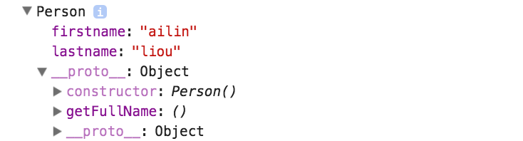

# 原型繼承 (Prototype)

* javascript 是使用 prototypal inheritance
* 每個函式都有原型屬性 (prototype property)，從它是空物件就誕生了。

### 原型鍊 (prototype chain)

在這個物件當中建立相同屬性的內容，在執行的時候它會先找物件中最上層的屬性。

### classical inheritance VS prototypal inheritance

* classical inheritance：在類別式語言中，物件是類別的實例 (instance)，類別能繼承其他類別。
* prototypal inheritance：javascript 的物件能直接繼承其他物件。

## 建立自訂物件

### 函數建構子 (function constructors)

* **不建議使用**
* 模仿 classic inheritance 所產生
* 使用 new 時，可將 this 指向新物件，但若忘記 new 的話，this 則會指向 globel，造成不可預期的結果。
* 函數建構子是被用來增加新物件的屬性和方法

```js
function Person(){
	this.firstname = 'Default';
	this.lastname = 'Default';
}

Person.prototype.getFullName = function() {
  return this.firstname + " " + this.lastname;
};

var alin = new Person();
// var alin = Person();
alin.firstname = 'ailin';
alin.lastname = 'liou';
console.log(alin);
```



### Object.create

**語法**

```
Object.create(proto, [ propertiesObject ])
```

* 原型繼承(prototypal inheritance)
* ECMAScript5 才新增的語法
* [Object.create() - JavaScript | MDN](https://developer.mozilla.org/zh-TW/docs/Web/JavaScript/Reference/Global_Objects/Object/create)


```js
var Person = {
    firstname: 'Default',
    lastname: 'Default',
    getFirstName: function(){
        return this.firstname;
    }
}

Person.getFullName = function() {
  return this.firstname + " " + this.lastname;
};

var alin = Object.create(Person);
alin.firstname = 'ailin';
alin.lastname = 'liou';
console.log(alin);
```


**傳遞第二參數**

`Object.create` 能傳遞第二參數，該參數是一個屬性列表，能夠初始化或者添加新對象的屬性，則更加豐富了創建的對象時的靈活性和擴展性。

[Object.defineProperty() - JavaScript | MDN](https://developer.mozilla.org/zh-CN/docs/Web/JavaScript/Reference/Global_Objects/Object/defineProperty)

```js
var Person = {
    firstname: 'Default',
    lastname: 'Default',
    getFullName: function(){
        return this.firstname + " " + this.lastname;
    }
}

var student = Object.create(Person, {
	name: {
        value:"xyz",
        writeable: false
    }
});
student.name = "abc";
console.log(student);
```

**delete**

```js
var Person = {
    firstname: 'Default',
    lastname: 'Default',
    getFullName: function(){
        return this.firstname + " " + this.lastname;
    }
}

var alin = Object.create(Person);
alin.firstname = 'ailin';
alin.lastname = 'liou';
delete alin.firstname;
console.log(alin.getFullName());
```

### 範例

```js
var Calculator = {
    x: 0,
    y: 0,
    add: function(){
        return this.x + this.y;
    },
    sub: function(){
        return this.x - this.y;
    },
    mul: function(){
        return this.x * this.y;
    },
    division: function(){
        return this.x / this.y;
    }
};

var myApp = Object.create(Calculator);

myApp.x = 6;
myApp.y = 2;
myApp.add();
```