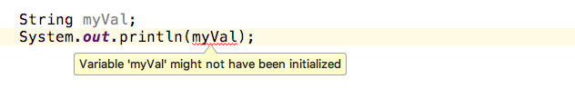

# 基本資料型別

* 又稱「簡單型別」或純值 (primitive types)
* 它不是物件
* 弱型別：又名「動態型別」 (dynamic typing)，不用先宣告是什麼型別，型別是由程式賦予值時才決定型別。

**基本型態種類**

* Boolean
* Number
* String
* null
* undefined (not set)
* Symbol (ES6)
 
### 布林值 (Boolean)

* true
* false

```js
var a = true;
var b = false;
```

### 數字 (Number)

只有一種數值型別，64 位元的符點數 (double)。
    
```js
var a = 1;
var b = 1.0;
console.log(a == b); // ?
console.log(a === b); // ?
```

<!-- true, true-->

### 字串 (String)

```js
var nickname = 'alincode';
var nickname = "alincode";
var message = "I've a pen. I've a apple.";
var message = 'I"ve a pen. I"ve a apple.';
var message = 'I\'ve a pen. I\'ve a apple.';
```

沒有 character 型別，如果要表示字元，就讓字串裡面只有一個字元。

```
'A' === '\u0041'    // true
```

### null (空值)

* 變數在初始為 null，就會產生 `null`。

```js
var a = null;
console.log(a);
```

```js
var a = null;
console.log(typeof a);
```
<!-- object, undefined -->

### undefined (未定義)

* not set
* Javascript 是在給值時才決定型態，所以在沒給值的情況下，就會現 `undefined`。

如果是需要編譯的語言會出現，如下圖所示：



```js
var b;
console.log('1 ===>');
console.log(b);
console.log('2 ===>');
console.log(typeof b);
```

```js
// 但請不要這麼做
var b = undefined;
console.log(b);
```

<!-- 解釋為什麼？ -->

```js
function printFullName(firstName, lastName){
  console.log(firstName + ' ' + lastName);  // ?
}

printFullName('alin');
```
<!--  alin undefined -->

還有另一種情況是 not define，不要把它跟 undefined 搞混。
<!-- console.log(aaaaaaaa); -->