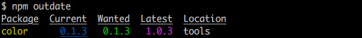

# NPM 補充

### 常用指令

**查看 NPM 使用說明**

```
npm help
```

**查看各個命令的簡單用法**

```
npm -l
```
**查看 NPM 的版本**

```
npm -v
```

**前往套件的官網**

```
npm home jquery
```

**前往套件的 repo**

```
npm repo jquery
```

**前往套件的 bug issue 列表**

```
npm bug jquery
```

**搜尋套件**

* [search | nam Documentation](https://docs.npmjs.com/cli/search)
* 別名有 s, se, find
* 可用正則表達式

```
npm search express
```

### 解決全域安裝權限問題

* 檢查 prefix 指定的位置：`npm config list -l`
* 編輯設定檔，更改 prefile 指定的位置：`npm config edit`
* 將 prefile 指定的位置，改到使用者具有足夠權限的資料夾。

```
prefix = "/Users/ailinliu/.nvm/versions/node/v6.9.4"
```

### 上線前鎖死版號

```
npm shrinkwrap
```

### 檢查過期的相依模組



[outdated | nam Documentation](https://docs.npmjs.com/cli/outdated)

```
npm outdated
```

<!-- npm install color@1.0.3 -S -->

