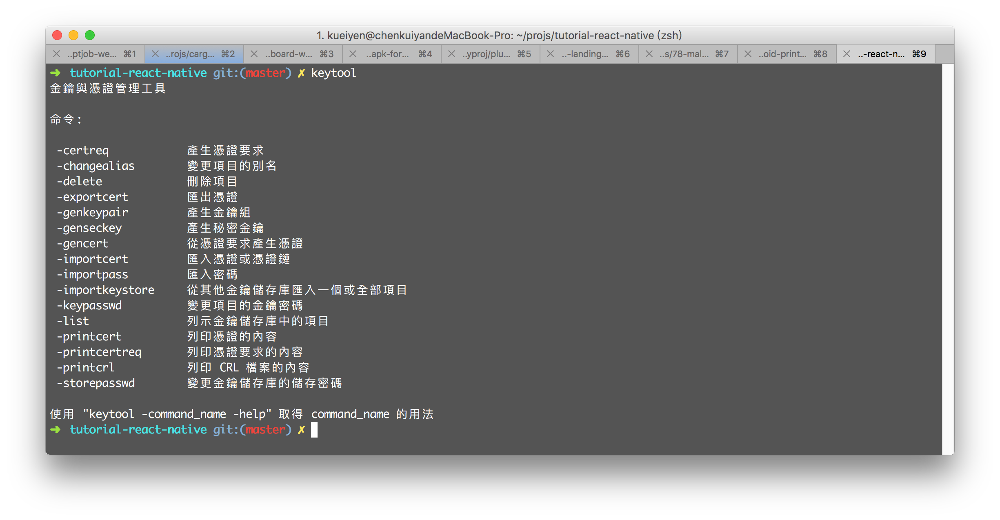
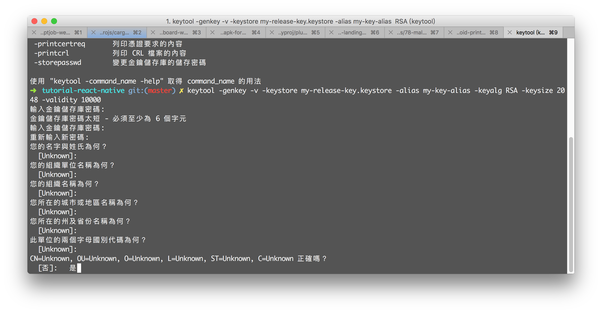

# 建立你專屬的 keystore 檔案

## Keytool v.s Keystore


Keytool 是一個 Java 資料證書的管理工具，它將金鑰（key）和證書（certificate）封裝成一個 keystore 的檔案。

在 keystore 裡，包含兩種資料：
- 金鑰實體（Key entity）：金鑰（secret key）又或者是私密金鑰和配對公開金鑰（採用非對稱加密）
- 可信任的證書實體（trusted certificate entries）：只包含公開金鑰


## 新建一個 React Native 專案

為了配合後續操作，本步驟需要先新建一個全新乾淨的 React Native 專案。

```
$ react-native init {projectName}
```

## 準備產生 keystore

確認 JDK 安裝完成後，輸入 `keytool` 會出現以下畫面：

```
$ keytool
```

※依據個人環境不同，有可能是中文或英文




### keytool 常用指令介紹

#### -genkey

在你的當前目錄中創建一個 `.keystore` 檔案，同時產生一個 `mykey` 的別名，其中中包含用戶的公開金鑰、私密金鑰和證書。

在沒有指定生成位置的情況下，keystore 會自動存放到使用者預設目錄，例如：使用 Windows 系統時，會生成在系統的 `C:\Documents and Settings\${UserName}\`，並且檔案名稱為 `.keystore`。

#### -alias

產生別名

- 預設值 -alias "mykey"

#### -keystore

指定金鑰庫的名稱(產生的各類資訊將不在.keystore文件中)

#### -keyalg

指定金鑰的演算法 (RSA/DSA)，如果不指定預設使用DSA

- 預設值 - -keyalg "DSA"

#### -validity

指定這組 keystore 有效期多少天

- 預設值 -validity 90

#### -keysize
指定金鑰長度
- 預設值 -keysize 1024

#### -storepass
指定金鑰庫的密碼(獲取keystore資訊所需的密碼)

#### -keypass

指定別名條目的密碼(私密金鑰的密碼)

#### -dname

指定證書擁有者資訊 例如："CN=名字與姓氏,OU=組織單位名稱,O=組織名稱,L=城市或區域名稱,ST=州或省份名稱,C=單位的兩字母國家代碼"

※如果沒有使用該指令則會出現互動式輸入

#### -v 

顯示金鑰庫中的證書詳細資訊

#### -keystore
指定keystore -file 指定匯出的證書位置及證書名稱 

- 預設值 -keystore  為使用者主目錄中名為 `.keystore` 的檔案

## 產生你的專屬 keystore

輸入：

```
$ keytool -genkey -v -keystore my-release-key.jks -keyalg RSA -keysize 2048 -validity 10000 -alias my-alias
```

※注意1：如果提示為中文，則需要輸入中文的 `是`；英文版則需要輸入 `y`。
※注意2：建立 keystore 時如果都不輸入資料會沒辦法在 Google Play 上發布！




## 參考
- [FacebookGenerating a signing-key](https://facebook.github.io/react-native/docs/signed-apk-android.html#generating-a-signing-key)
- [Google：Sign Your App - Android Studio](https://developer.android.com/studio/publish/app-signing.html)
