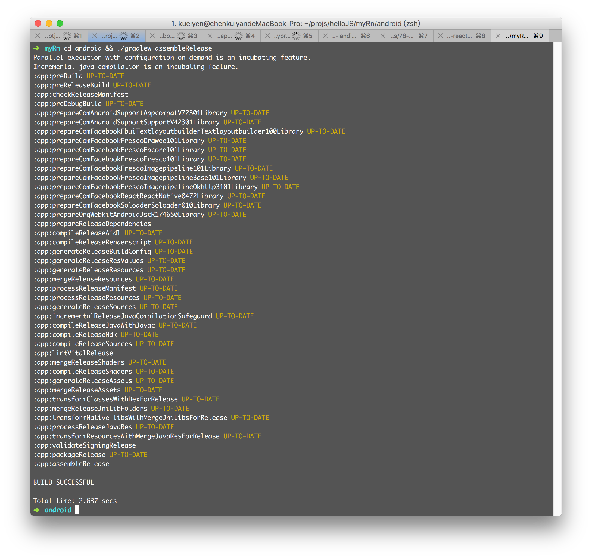
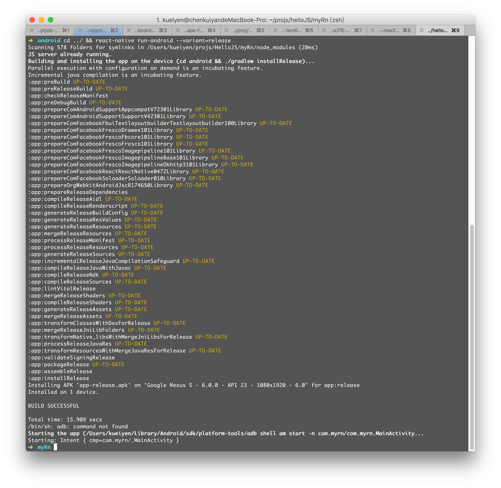
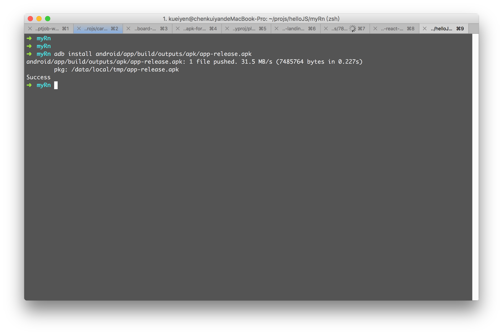

# 打使用 keystore 簽署 React Native app

## 打包 APK

```
$ cd android && ./gradlew assembleRelease
```



封裝好的 APK 會儲存在專案目錄下的 `android/app/build/outputs/apk/app-release.apk`

## 安裝打包好的 APK

```
$ cd ../ && react-native run-android --variant=release
```


 
## 手動將 APK 安裝到手機上

```
$ adb install android/app/build/outputs/apk/app-release.apk
```



## 參考
- [Facebook：Generating the release APK](https://facebook.github.io/react-native/docs/signed-apk-android.html#generating-the-release-apk)
- [Google：Sign Your App - Android Studio](https://developer.android.com/studio/publish/app-signing.html)

