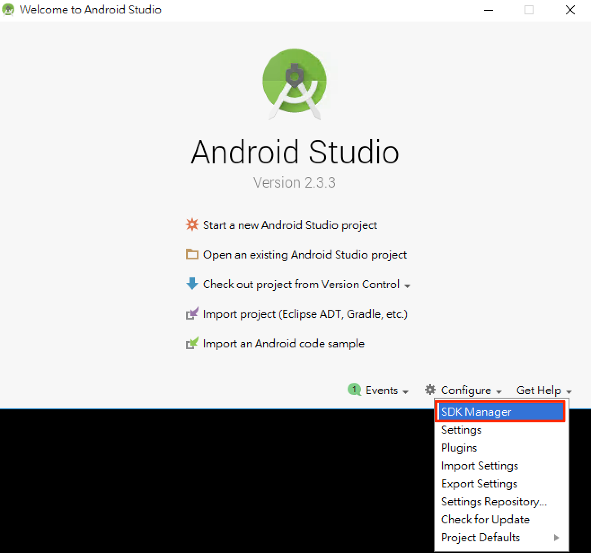
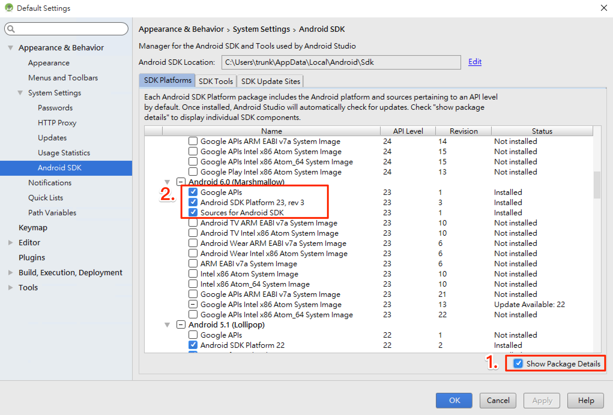
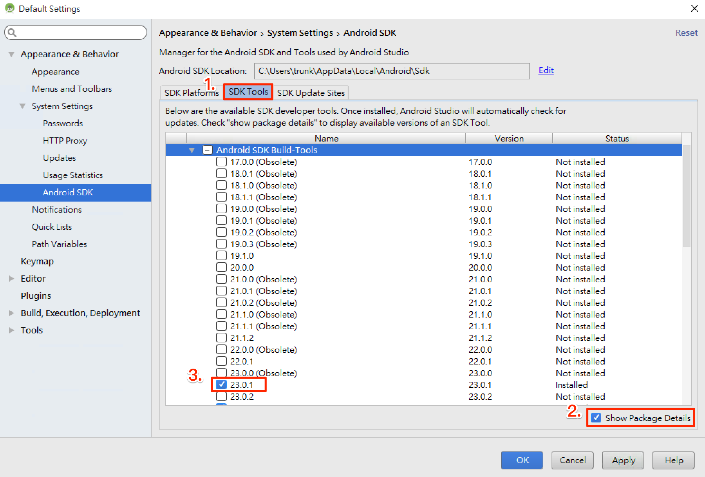
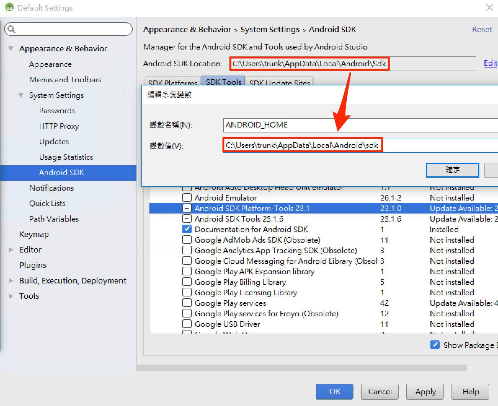
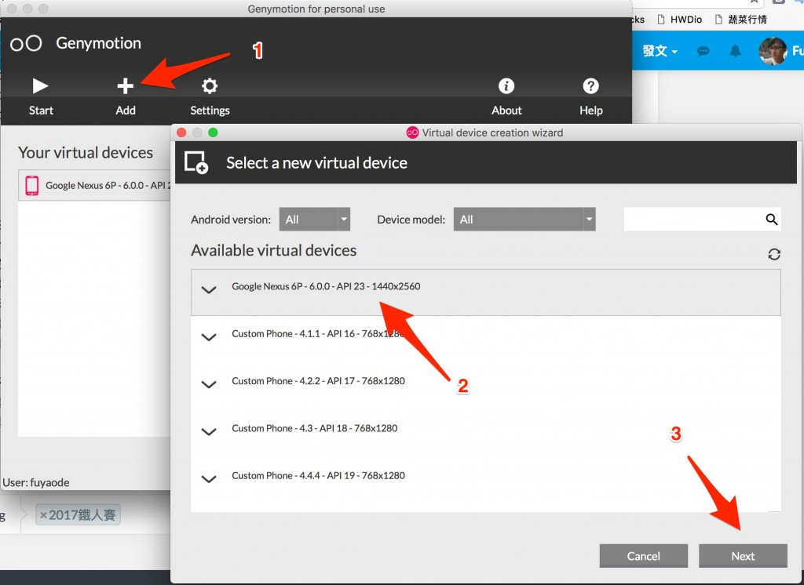

# 開發環境

## NodeJS

## Android SDK
React Native 目前需要 Android Studio2.0 或更高版本。

- 下載 [Windows Android Studio](https://developer.android.com/studio/index.html)
- 安裝 Android Studio - [教學影片](https://developer.android.com/studio/install.html)
- 安裝 SDK

SDK Platforms 選擇 **Google APIs** 、 **Android SDK Platform 23**

SDK Tools 選擇 **Android SDK Build-Tools 23.0.1**



### Android 環境變數
確保 ANDROID_HOME 環境變數跟 SDK 路徑一致  

**Windows**  
控制台 > 系統及安全性 > 進階系統設定 > 進階 > 環境變數 > 新增


控制台 > 系統及安全性 > 進階系統設定 > 進階 > 環境變數 > 選擇 PATH > 編輯
在後方新增  
`;C:\Users\使用者名稱\AppData\Local\Android\sdk\platform-tools;C:\Users\使用者名稱\AppData\Local\Android\sdk\tools`

**Mac**
開起 ~/.bashrc 或 ~/.zshrc 或 ~/.profile 在最後加上
```
export ANDROID_HOME=${HOME}/Library/Android/sdk
export PATH=${PATH}:${ANDROID_HOME}/tools
export PATH=${PATH}:${ANDROID_HOME}/platform-tools
```
## Android 虛擬機

- 註冊、下載 [genymotion](https://www.genymotion.com/pricing-and-licensing/)
- 新增虛擬機



## 常見問題


## 延伸閱讀
* 官方文件 [Android 開發環境 - for Mac](http://facebook.github.io/react-native/releases/0.44/docs/getting-started.html#android-development-environment)
* 官方文件 [Android 開發環境 - for Windows](http://facebook.github.io/react-native/releases/0.44/docs/getting-started.html#android-development-environment)
* [簡中環境教學](http://reactnative.cn/docs/0.47/getting-started.html)
